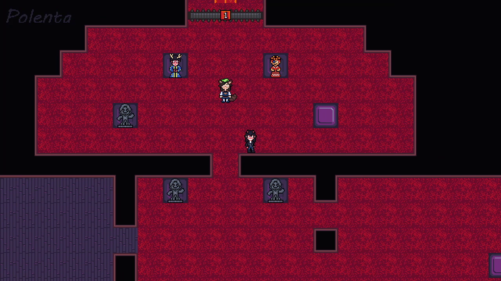
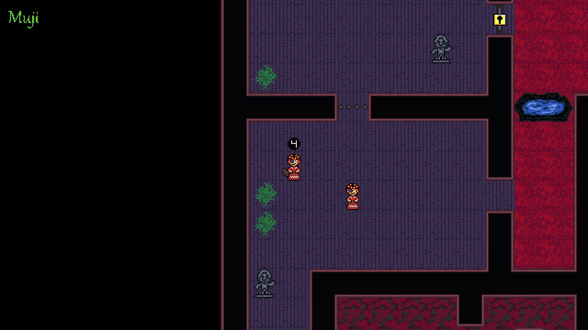
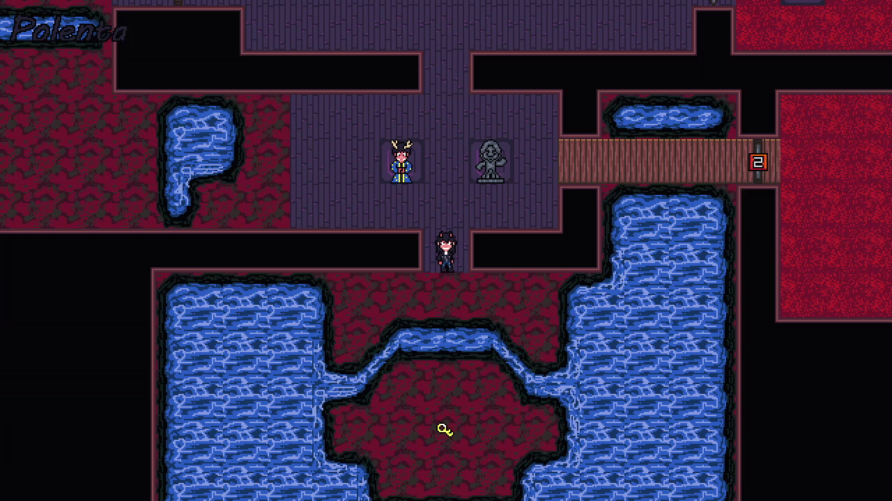

# Down the Count

Made in 5-ish days for the GMTK 2026 game jam, where the theme was 'Countdown'.

Didn't have time for a tutorial, so here are some controls:

Arrow keys / WASD - Move one tile

Q/E and Comma/Period - Switch characters

Z / Space / Enter - Advance dialog

Backspace or U - Undo previous move

M - Toggle music

Each character has a signature ability that will help you solve the puzzles

Muji - When he walks into another player, he takes on their ability for a short time frame.

Panettone - He can push statues by walking into them

Polenta - She can leap over pits of water if there is a 1-tile gap

Boromi - She can slip through steel bars

Music is by [Jay Dante](https://jay-dante.itch.io/)

Sound credits

footstep.wav - https://freesound.org/people/Ali_6868/sounds/384880/
key - https://freesound.org/people/160033/sounds/366186/
locked - https://freesound.org/people/dj997/sounds/485649/
unlock - https://freesound.org/people/cemagar/sounds/120337/
switch, unswitch https://freesound.org/people/EricsSoundschmiede/sounds/457410/
push.wav - https://freesound.org/people/Mafon2/sounds/349913/
poof.wav - https://freesound.org/people/saangosu/sounds/815438/
jump.wav - https://freesound.org/people/SamuelGremaud/sounds/517636/
crunch. wav- https://freesound.org/people/Zott820/sounds/655708/

Also used some fonts from here:

https://bsl.itch.io/inkbit

https://somepx.itch.io/humble-fonts-gold-ii

